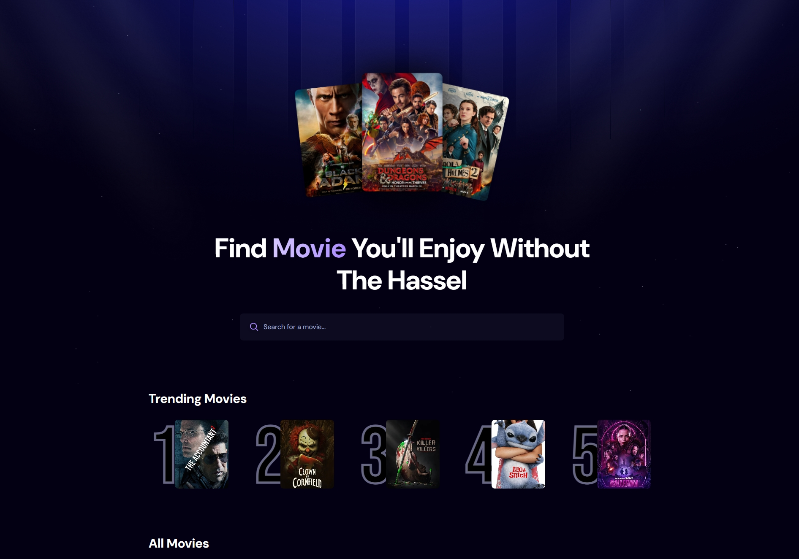
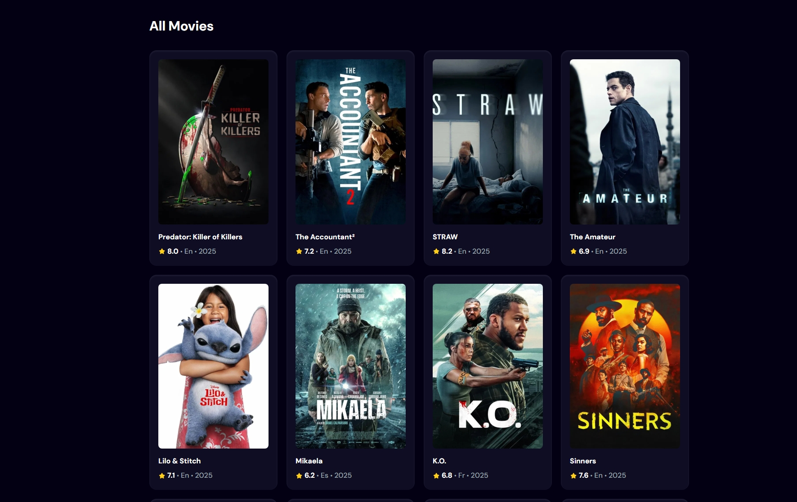
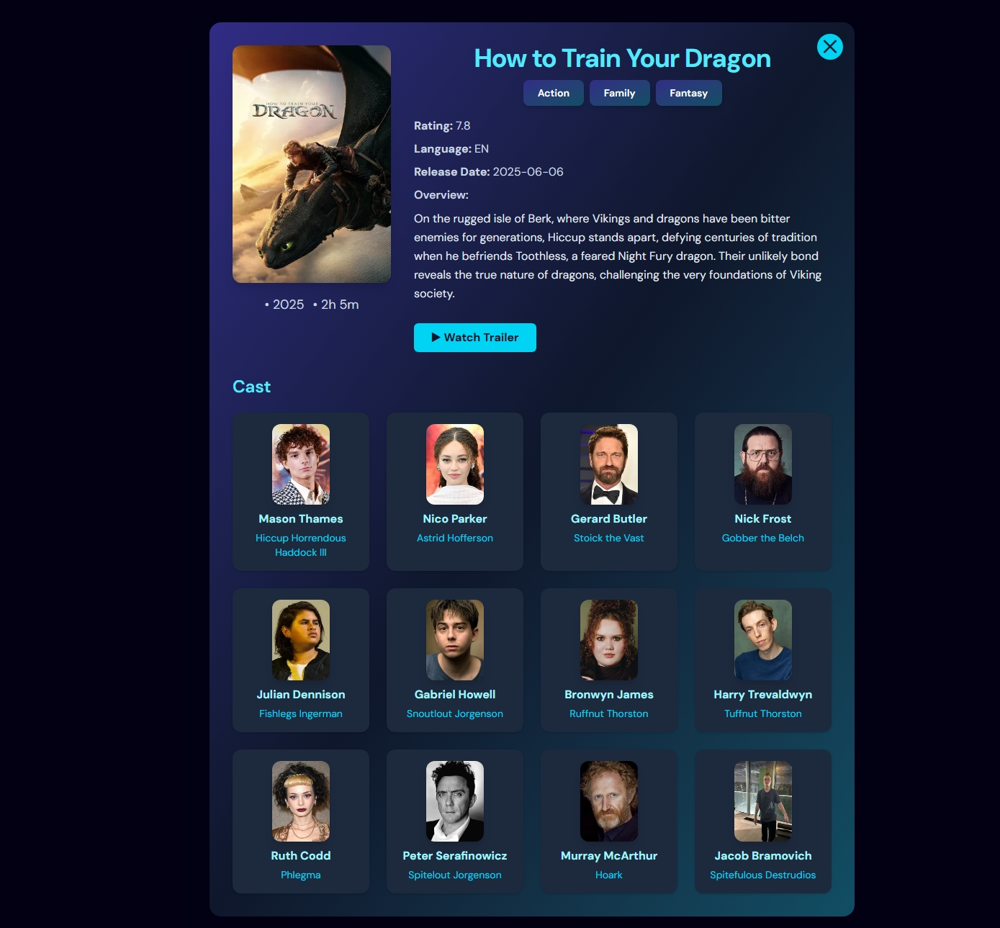
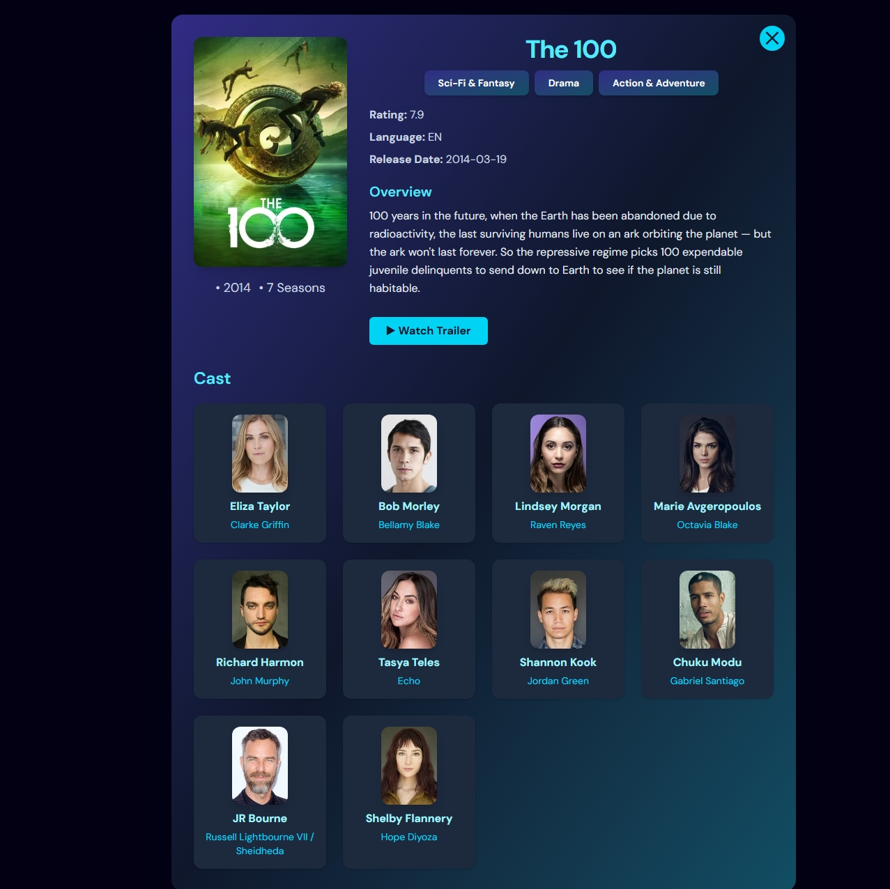

# Movie Gallery 🎬

A modern React app to browse movies and TV shows using [The Movie Database (TMDb)](https://www.themoviedb.org/) API.  
Beautiful UI, responsive design, and detailed info for each title!



---

## Features

- 🔍 **Search** for movies and TV shows
- 🎞️ **Detail pages** for movies and TV shows (overview, genres, cast, trailer, etc.)
- 👥 **Cast info** with images and roles
- 📺 **Watch trailers** directly in the app
- 🌙 **Modern dark UI** with Tailwind CSS
- ⚡ **Fast** and responsive

---

## Getting Started

### 1. Clone the repository

```bash
git clone https://github.com/TemesgenMeles/MovieGallary.git
cd movie-gallery
```

### 2. Install dependencies

```bash
npm install
```

### 3. Get a TMDb API Key and set up Appwrite

- Sign up at [TMDb](https://www.themoviedb.org/) and get your API key.
- Make sure you have an [Appwrite](https://appwrite.io/) project and get your Project, Database, and Collection IDs.
- Create a `.env.local` file in the root and add:

```
VITE_TMDB_API_KEY=YOUR_TMDB_API_KEY
VITE_APPWRITE_PROJECT_ID=YOUR_APPWRITE_PROJECT_ID
VITE_APPWRITE_DATABASE_ID=YOUR_APPWRITE_DATABASE_ID
VITE_APPWRITE_COLLECTION_ID=YOUR_APPWRITE_COLLECTION_ID
```

> Replace the values above with your actual Appwrite and TMDb keys/IDs.

### 4. Start the development server

```bash
npm run dev
```

Open [http://localhost:5173](http://localhost:5173) in your browser.

---

## Folder Structure

```
src/
  components/
    pages/
      MovieDetail.jsx
      TvShowDetail.jsx
    ...
  App.jsx
  main.jsx
  index.css
public/
  No-Poster.png
  demo-screenshot.png
```

---

## Example Screenshots

### Home Page



### Movie Detail



### TV Show Detail



---

## Customization

- **Colors:** Easily change colors in `index.css` or Tailwind config.
- **API:** All API calls are in the loader functions of each detail page.
- **Images:** Place your own screenshots in the `public/` folder for the README.

---

## License

MIT

---

**Made with ❤️ using React, Tailwind CSS, and TMDb API**
